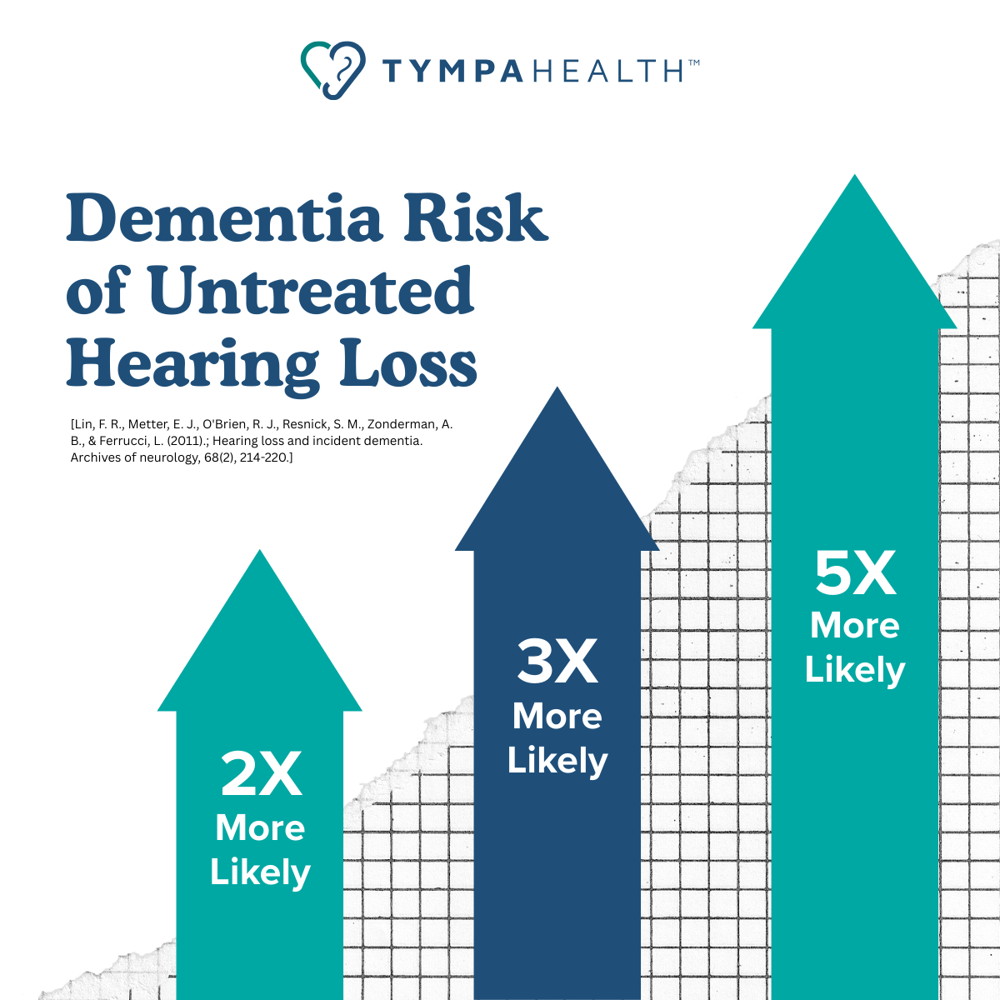

# Devin Healy

## PORTFOLIO

As a marketer of 10+ years, with a foundation in writing and end-to-end campaign development, I've specialized in the healthcare and medtech/healthtech sectors for the bulk of that time. This is a snapshot of projects I've been deeply involved in at various levels, spanning across agencies, startups, enterprise brands & independent marketing support.

## Sample 1: Medical Microinstruments - Symani Surgical System
A breakthrough robotic technology, uniquely designed for microsurgery and supermicrosurgery, that provides surgeons unmatched precision and control to restore function and quality of life.

[https://www.mmimicro.com/](https://www.mmimicro.com/)
[https://www.mmimicro.com/symani/](https://www.mmimicro.com/symani/)

**Support:**
- Go-to-market campaign development
- Paid media campaign strategy
- Ad channel management
- Web content writing

---

## Sample 2: J&J MedTech CARTO™ System - Integrated by Design Campaign

[https://www.jnjmedtech.com/en-US/products/cardiovascular/carto/overview/](https://www.jnjmedtech.com/en-US/products/cardiovascular/carto/overview/)
The CARTO System is the standard in advanced in 3D mapping technology across a wide range of electrophysiology procedures.

**Support:**
- Product campaign development
- Video testimonial direction & coordination
- Landing page design & content writing
- Web content writing

---

## Sample 3: TympaHealth Technologies, US

[https://tympahealth.com/us/](https://tympahealth.com/us/)
Tympa is the only fully comprehensive ear and hearing health solution - built to fit effortlessly into any healthcare environment and empower new ways of delivering care.

**Support:**
- Marketing management & asset development
- Organic channel strategy
- Channel management
- Content writing
- Collateral asset design

